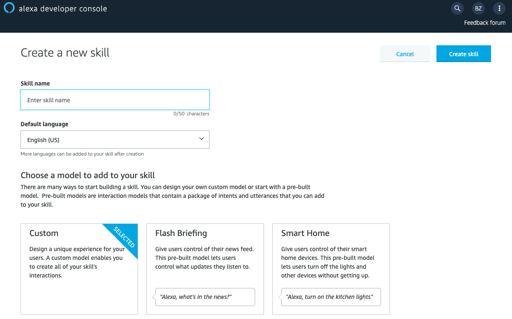
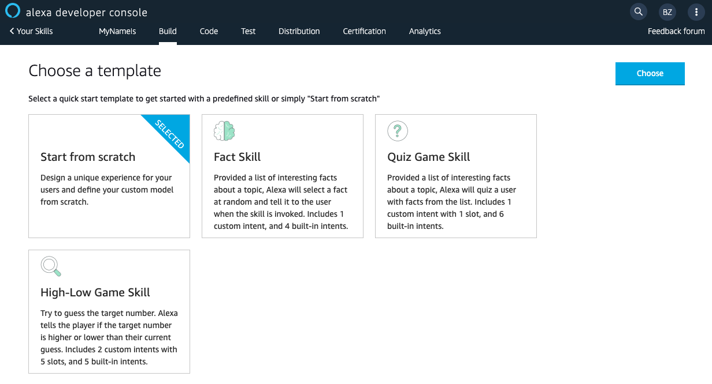
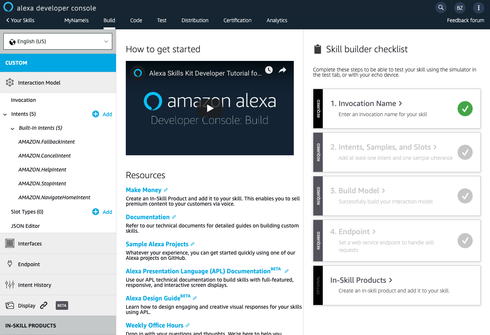

# Part 1 - Build your first skill

## Open and Amazon Alexa Developer Account
Open https://developer.amazon.com and follow the instruction to open a new account.

## Create your first skill
Go to the main skills page and click the ```Create Skill``` button.

In the ```Create a new skill``` page give your skill a name, set your default language to English (US) and selecy ```Custom``` as the model to add to your skill.



On the next page you will be asked to Chose a template - select ```Start from scratch```.



### Welcome to your skill Build page!
This is the main page we will use to build our skill


