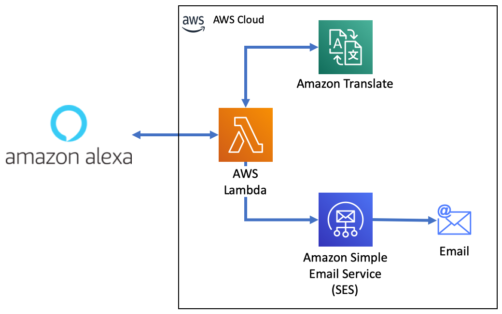

# Alexa Lambda Workshop
In this workshop we will build an Amazon Alexa skill, backed by an [AWS Lambda](https://aws.amazon.com/lambda/), using multiple AWS services such as Amazon SES and Amazon Translate.

At the end of the workshop, you will have a voice skill that enables you to dictate short email to Alexa and send then to the recipient, using [Amazon Simple Email Service](https://aws.amazon.com/ses/), in the original language (English) or translate it to one of the 25 languages, supported by [Amazon Translate](https://aws.amazon.com/translate/).

This workshop has 3 parts:

[Part 1 - Create your first skill](BuildYourFirstSkill.md)
- A basic setup of your account on Alexa Developer Console and first skill setup.

[Part 2 - Email dictation skill]()
- Connect your skill to an AWS backend using AWS Lambda.

[Part 3 - Add translation capabilities to your skill]()
- Extend your skill to be able to translate your email based on the desired target language.

[Start Part 1](BuildYourFirstSkill.md) >>
