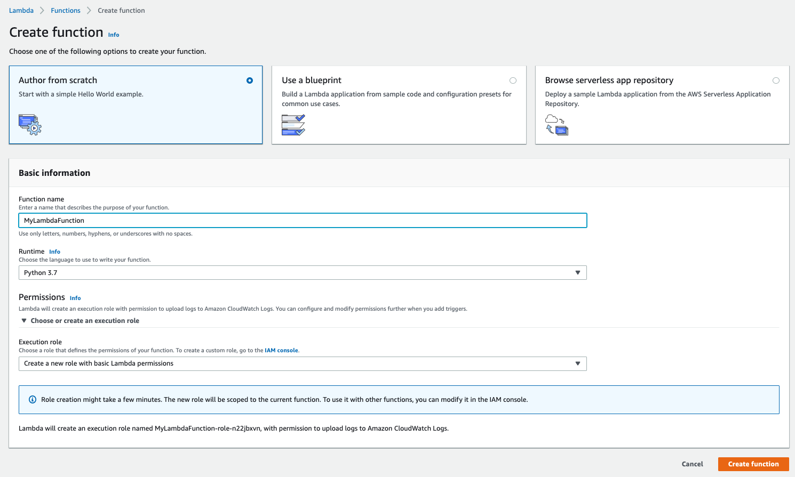
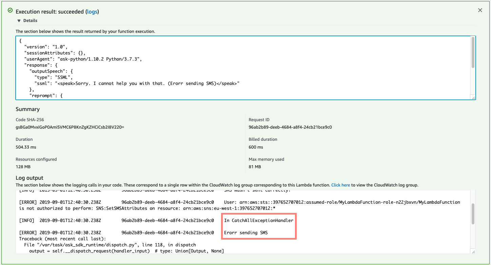
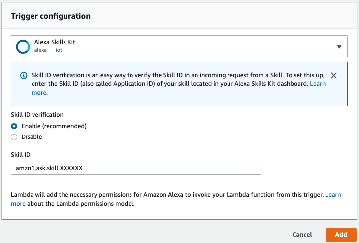

# Part 2 - SMS dictation skill

For this part we are going to use the basic skill we have created in [Part 1 - Create your first skill](BuildYourFirstSkill.md). If you did not complete this part, please do it now and come back to part 2 later.

## Extending our current skills
As mentioned before, we will use the exiting skill and intents you should have from step 1.

For SMS dictation, we will need to extend the basic ```GetMyName``` intent to deal with multiple Utterances, Slots and additional components (such as our backend endpoint to process the SMS).

### Rename your intent
As a first step, let's rename the intent to ```SendSMS```. Click on the intent name and change it. Save your model to apply changes.

### Change Sample Utterances
Our original intent was all about the user name. We need to change our current intent to support session initiations related to SMS sending.
Update your ```Sample Utterances``` to support new dialogs.
You should add utterances such as:
- I would like to send an SMS
- Send SMS
- Send message
- Etc.

### Adding additional slots
Our SMS skill will need several slots to send our message:
- Sender name - We will use the already available ```myName``` slot.
- Recipient name (```toName```)
- Recipient phone number (```toPhone```)
- SMS body (```body```)

Go and add the missing slots and define slot types, prompts and user utterances.

At the end of the process you should have something like the next screenshot in your Intent Slots list:


The ```AMAZON.SearchQuery``` slot type is used for open text inputs in our skill.

At this stage you can use the new slots to update your main ```Sample Utterances```to use those slots in customers request. You should add utterances such as 'I would like to send an SMS to ```{toName}```'

### Intent Confirmation
Since we want to make sure Alexa got the right SMS details before sending it, we will use ```Intent Confirmation``` to verify the input before sending it out.

To do that, turn on ```Intent Confirmation``` and define a prompt, using the different slots that Alexa should say before sending out the SMS.

## Save, Build and Profile
Save your model (if you did not already) and run your Build.

Test your ```SendSMS``` intent and make sure you can perform a dialog with the skill until you get the Intent confirmation.

## AWS Lambda integration
To enable Alexa skills to perform actions, we need to integrate it with some kind of a backend for fulfillment. One of the easiest ways to do so is to integrate your Alexa Skill with AWS Lambda as the backend.

### Add your Lambda function integration
This workshop includes the AWS Lambda code needed for your skill to perform SMS sending in the [```sendSMSSkillLambda```](./sendSMSSkillLambda) folder. Navigate to this folder and download the [```function.zip```](./sendSMSSkillLambda/function.zip) and [```lambda_function.py```](./sendSMSSkillLambda/lambda_function.py) files to your local machine.

To make it a bit more interesting, we have omitted some of the  code from the Lambda function, so you will have to edit it a bit before you will be able to use it. Please review the code and replace all ```[YOUR_CODE_IS_HERE]``` sections with the right code.

Before uploading your code, please read and follow the steps in the Lambda function [```README.md```](./sendSMSSkillLambda/README.md) file.

#### Upload Lambda code
Open [AWS Management Console](https://console.aws.amazon.com/) and login to your account. Select a region (we recommend using Ireland/EU-WEST-1) and go to Services --> Lambda.

Click ```Create function```, name your new function, select **Python 3.7** as your runtime and create a new execution role with basic Lambda permission (we will edit permission later on). When done, click ```Create function```


Next stage is uploading your code (in zip file format) to the console. On the function edit page, navigate to the **Function code** section, change ```Code entry type``` to ```Upload a .zip file```. Browse for your latest version of your ```function.zip``` file and hit ```Save``` on the top right of the page.

When the upload is done, you should see your code and tree structure of your .zip file in the WYSIWYG editor.
To connect your lambda with your new code, you will need to make sure the function Handler and the file name and handler are the same.

#### Add test event
If you want to test your code without the need to interact with your skill each time you want to initiate a Lambda execution, you will have to define a test event for your function.

Click on **Test** at the top right of the page and define a new test event, using the JSON in [```LambdaTestEvent.json```](./sendSMSSkillLambda/LambdaTestEvent.json) file provided in the code folder. This JSON is an example of the JSON your code will get from your skill, each time the skill will need to trigger the Lambda integration. Make sure you update the JSON with a correct phone number to be used in your test events.


After creating the test event, next time when you hit the test button, it will execute your code. Go and run your code now.

You will see the results of your execution at the top of the page. You can look at the result returned by your function execution at the top of the window and full log at the bottom.
If all went well, you should see a similar output as the screenshot below:

As you can see, although your code was executed successfully, There is an exception that was raised. Check the log output section to find out the reason for this exception.

#### Setup Lambda IAM Role permissions
As you saw in the previous section, the reason for our exception is insufficient permissions of our Lambda functions to access SNS.

To fix that, we need to provide the role that was created during our function creation, the right permissions to access SNS.

Scroll down to the **Execution role** section and click on the ```View the [ROLE_NAME] role on the IAM console```. On the **Permissions** tab click on the available policy name. This will show you the available permission for this policy. Edit the policy and in the JSON edit screen add the next statement to allow access to the needed SNS actions.

```
  {
      "Sid": "Workshop",
      "Effect": "Allow",
      "Action": [
          "sns:Publish",
          "sns:SetSMSAttributes"
      ],
      "Resource": "*"
  }
```
Return to your Lambda function page and test it again. If you followed the steps above, you should get an SMS to the phone number you are using in the test event.

#### Setup Alexa Skill as a trigger
Next, we need to allow our Alexa skill to trigger this Lambda function.

Go back to your Alexa Developer Console build page and scroll down to the **Endpoint** section. This is the page that allows you to define your Skill endpoint(s). Copy ```Your Skill ID``` and go back to the AWS Lambda console. Click on ```Add Trigger```, select ```Alexa Skills Kit```, enable ```Skill ID verification```, paste your Skill ID and click ```Add```.


#### Set Alexa Skill endpoint
Last stage is to define our Lambda function as the endpoint for our Alexa skill. Before going back to the Alexa Developer Console, copy your Lambda function ARN from the top right corner of you Lambda page.

Go back to **Endpoint** definition page in the Alexa Developer Console and paste the Lambda ARN to the ```Default Region``` endpoint.

Save your Endpoint and rebuild your Skill. You are done!

## Test it all together

Ready to move on? [Click here - Part 3 >>](AddTranslation.md)
